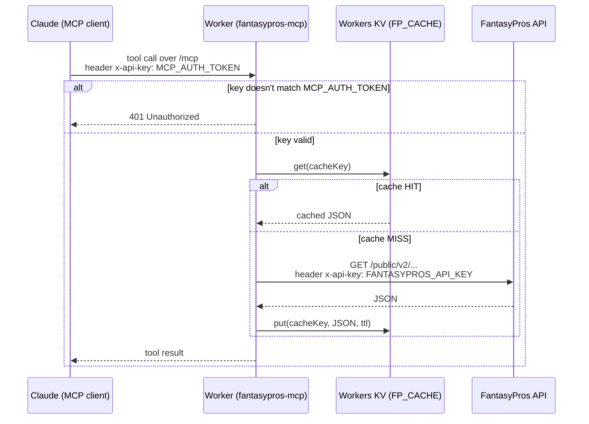

# fantasypros-mcp

A remote MCP server on Cloudflare Workers that wraps the FantasyPros v2 API
(injury news, player lookup, consensus rankings, projections) so an MCP
client (Claude, etc.) can call it as proper tools instead of you running
PowerShell one-offs.

Your FantasyPros API key lives only as a Cloudflare Worker secret — it never
appears in chat, source control, or client config again.

## Tools this exposes

- `get_injury_news` — latest injury newswire, optionally filtered to one player
- `get_player_news` — any-category news for one player by `fpid`
- `get_player` — look up a player's name/team/position by `fpid`
- `get_consensus_rankings` — expert consensus rankings by position/week (also
  the most reliable way to find a player's `fpid` — the full `/players` list
  is truncated on the free tier, rankings lists aren't)
- `get_projections` — weekly or season-long fantasy point projections

## How it works



Two different `x-api-key` headers are in play here and it's easy to
conflate them: the **inbound** one (Claude → Worker) is checked against
`MCP_AUTH_TOKEN` and just gates the Worker so it isn't an open proxy; the
**outbound** one (Worker → FantasyPros) is your actual `FANTASYPROS_API_KEY`
and is what FantasyPros bills against. The KV cache sits in between so a
cache HIT never touches FantasyPros (and doesn't count against your
50-requests/day free-tier quota) — only a MISS does.

## 1. Prerequisites

- Node.js 18+
- A free Cloudflare account — sign up at https://dash.cloudflare.com/sign-up
  if you don't have one. No credit card needed for what this project uses
  (Workers + KV free tiers).
- Your FantasyPros API key (from https://secure.fantasypros.com/api-keys/)

## 2. Install

```bash
npm install
npx wrangler login
```

`wrangler login` opens your browser and asks you to approve access to your
Cloudflare account (an OAuth consent screen) — log in there if you aren't
already, click Allow, and come back to the terminal. This is a one-time
step per machine; Wrangler caches the token afterward.

**If this is a brand-new Cloudflare account with no Workers deployed yet**,
visit the Workers & Pages section of the dashboard
(https://dash.cloudflare.com → **Workers & Pages**) once before continuing.
Loading that page the first time is what provisions your account's
`workers.dev` subdomain (e.g. `yourname.workers.dev`), which `wrangler
deploy` needs in step 5. Skipping this isn't fatal — Wrangler will usually
prompt you to pick a subdomain interactively during deploy instead — but on
some account states it fails outright with `You need a workers.dev
subdomain in order to proceed` and no direct link to fix it, so it's faster
to just visit the dashboard once up front.

## 3. Set secrets

Two secrets — never put these in wrangler.jsonc or commit them anywhere:

```bash
npx wrangler secret put FANTASYPROS_API_KEY
# paste your FantasyPros key when prompted

npx wrangler secret put MCP_AUTH_TOKEN
# paste a random token you generate yourself, e.g.:
#   openssl rand -hex 32
# this locks the Worker down so it isn't an open proxy for your
# FantasyPros key (and your 50 req/day free-tier budget) to anyone
# who finds the URL
```

## 4. Create the KV cache

Tool responses are cached in Workers KV so repeated questions in a chat (or
across a few chats the same day) don't burn through the FantasyPros free
tier's 50 requests/day. Create the namespace and wire it into
`wrangler.jsonc`:

```bash
npx wrangler kv namespace create FP_CACHE
```

This prints something like:

```
[[kv_namespaces]]
binding = "FP_CACHE"
id = "abcd1234..."
```

Copy that `id` into the `kv_namespaces` entry already stubbed out in
`wrangler.jsonc` (replacing `REPLACE_WITH_KV_NAMESPACE_ID`).

Cache TTLs are set per endpoint in `CACHE_TTL_SECONDS` in `src/index.ts` —
2 minutes for news (it moves fast), 15 minutes for rankings/projections, an
hour for player lookups. Adjust there if you want fresher or longer-lived
data. The KV free tier (100k reads/day, 1k writes/day, 1 GB storage) is far
more than this project will ever need.

## 5. Deploy

```bash
npx wrangler deploy
```

This prints your Worker's URL, something like:
`https://fantasypros-mcp.<your-subdomain>.workers.dev`

If you skipped the dashboard visit in step 2 and this is your first Worker
ever, Wrangler may prompt you here to choose a `workers.dev` subdomain — or,
on some accounts, fail with `You need a workers.dev subdomain in order to
proceed`. If you hit that error, go to
**dash.cloudflare.com → Workers & Pages**, let the page load once (this
provisions the subdomain), then re-run `npx wrangler deploy`.

## 6. Test it locally (optional but recommended)

```bash
npx wrangler dev
```

Then, in another terminal, point the official MCP inspector at it:

```bash
npx @modelcontextprotocol/inspector
```

Connect to `http://localhost:8787/sse`, adding an `x-api-key: <your
MCP_AUTH_TOKEN>` header in the inspector's connection settings (just the raw
token value, no "Bearer" prefix). You should see the five tools listed and
be able to call them.

## 7. Connect it to Claude

Add it as a custom MCP connector, pointing at:

```
https://fantasypros-mcp.<your-subdomain>.workers.dev/mcp
```

(This is the Streamable HTTP endpoint, and the one actually used to build
and test this project. The Worker also serves `/sse` for clients that only
speak the older SSE transport, but `/mcp` is the one to reach for by
default.)

You'll need to attach `x-api-key: <your MCP_AUTH_TOKEN>` (just the raw token
value, no "Bearer" prefix) as a custom header on the connection — not
`Authorization`, which Claude's custom-connector UI reserves for its own
OAuth flow and won't let you set as a plain header under "No sign-in" mode;
that's why this Worker checks `x-api-key` instead. **Check what the
connector-setup UI you're using actually supports** — some custom-connector
flows only support OAuth or no auth at all, not an arbitrary custom header.
If that's the case here, your options are:

- Put the Worker behind **Cloudflare Access** (Zero Trust) instead of the
  in-code bearer check, and let Access handle auth at the edge.
- Temporarily strip the bearer check in `src/index.ts` while you confirm
  everything else works, then re-add real auth before leaving it deployed
  (an unauthenticated Worker is a public proxy for your API key).

## Sharing this with someone else

Two ways to let another person use it, depending on how much you want them
sharing your FantasyPros quota vs. running independently:

**Option A — give them the URL and the token (simplest).** Anyone with
`https://fantasypros-mcp.<your-subdomain>.workers.dev/mcp` and your
`MCP_AUTH_TOKEN` can add it as their own custom MCP connector, same as you
did in step 7. Fastest option for a handful of trusted people (family
league, friends), but it's your Worker and your FantasyPros key underneath
— everyone shares the same 50-requests/day budget (the KV cache helps here,
since overlapping questions across people get served from cache) and
anyone with the token can call it indefinitely. To cut someone off, rotate
the token:
```bash
npx wrangler secret put MCP_AUTH_TOKEN
```
This invalidates the old value for **everyone** — you'd need to hand out
the new one to anyone who should keep access.

**Option B — give them the code, they deploy their own.** Send them this
repo (zip, GitHub, whatever). They run steps 1–7 themselves with their own
FantasyPros API key and their own generated `MCP_AUTH_TOKEN`. More setup
work for them, but full independence — their own quota, their own secret,
nothing shared with you. Better if you're handing this to more than a few
people, or to someone you don't want holding a live credential to your
Worker.

For a small trusted group, Option A is the practical choice — just be
aware it's a shared quota and a shared secret, not per-user access.

## Notes / gotchas

- **The `/public/` path segment is required.** `api.fantasypros.com/v2/...`
  404s or 403s even with a valid key — it must be
  `api.fantasypros.com/public/v2/...`. This code already has that right.
- **Free tier = 50 requests/day, truncated responses.** Responses are now
  cached in Workers KV (see step 4) with per-endpoint TTLs, so repeated
  questions in a session reuse the cached copy instead of hitting
  FantasyPros again. Only a genuine cache miss (or an expired TTL) counts
  against the daily quota.
- **`wrangler kv namespace create` can fail with `Authentication error
  [code: 10000]`** even when you're logged in and your token has the right
  scopes (`workers_kv (write)` etc.). This is a known flaky spot in
  Wrangler's OAuth flow, not a real permissions problem — `wrangler deploy`
  can work fine in the same session where `kv namespace create` errors out.
  Workaround: create the namespace from the Cloudflare dashboard instead
  (**Storage & databases → KV → Create Instance**), then copy the printed
  **Namespace ID** into `wrangler.jsonc` by hand. The ID isn't shown on the
  namespace's Settings tab in the current dashboard — read it out of the
  browser URL while viewing the namespace
  (`.../workers/kv/namespaces/<id>/...`), or from the KV list view.
- **Don't trust the KV dashboard for real-time verification.** Both the
  Metrics tab (read/write counts) and the KV Pairs tab (live key listing)
  can lag or appear stale for longer than you'd expect right after a
  write — neither is a reliable "did my cache actually work" signal. The
  `fpFetch` helper logs `[cache] HIT/MISS/WROTE <key>` on every call; watch
  those with `npx wrangler tail` while triggering a tool call for ground
  truth on whether a request was served from cache.
- **Rotate secrets if exposed.** If either secret ever leaks (posted in
  chat, committed by accident, etc.), reset it:
  `npx wrangler secret put FANTASYPROS_API_KEY` (or `MCP_AUTH_TOKEN`) to
  overwrite it — no redeploy needed.
